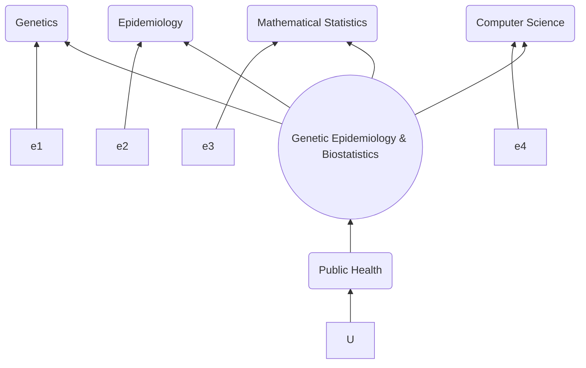

```mermaid
graph BT;
e1 --> F1(Genetics);
e2 --> F2(Epidemiology);
e3 --> F3(Mathematical Statistics);
e4 --> F4(Computer Science);
B((Genetic Epidemiology & Biostatistics)) --> F1(Genetics);
B((Genetic Epidemiology & Biostatistics)) --> F2(Epidemiology);
B((Genetic Epidemiology & Biostatistics)) --> F3(Mathematical Statistics);
B((Genetic Epidemiology & Biostatistics)) --> F4(Computer Science);
A(Public Health) --> B((Genetic Epidemiology & Biostatistics));
U --> A(Public Health);
```

